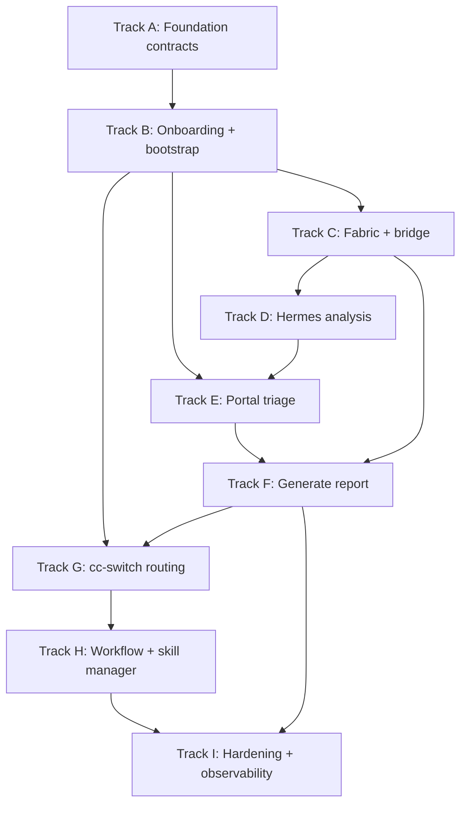

# Pentest Workflow Management System

## What We're Building

A pentest workbench where **one command bootstraps the full stack** with a guided onboarding process. You install it, the setup wizard checks your machine, configures everything, and you're ready to create engagements.

**The operator is always the decision maker. AI is the research assistant.**

### First Install (one time)

```
docker compose up
  → Onboarding wizard starts
  → Detects: GPU model, VRAM, RAM, CPU
  → Suggests: "Your RTX 4090 (24GB) can run Qwen 32B locally"
  → User accepts suggestion AND/OR adds their own models:
     • Local: Ollama Qwen 32B, LM Studio DeepSeek, OpenClaw
     • Cloud: OpenRouter Claude Sonnet, Google Gemini
  → System saves the model pool
  → Done — models available for dynamic routing
```

**The model pool is set up once, but routing is DYNAMIC at runtime.** cc-switch picks the best model for each task based on the task's requirements and the model's capabilities.

## Reality Check (2026-05-20)

This document is the target architecture plus the current build state. Several items that older drafts called "missing" are now implemented locally, but not all are wired end-to-end or verified against the live Supabase project.

**Built locally:**
- Portal setup wizard shell: `csp-audit/report-viewer/app/setup/page.tsx`
- Hardware detection endpoint and script: `/api/setup/hardware`, `scripts/detect-hardware.sh`
- Setup persistence endpoint: `/api/setup/save`, writing `system_config` and populating the app's current model registry table, `model_configs`
- Model settings UI/API: `/settings/models`, `/api/models/config`, `/api/models/choose`, `/api/models/usage`
- Workflow templates/plans/steps schema and portal workflow planning UI
- Submissions and duplicate-tracking schema in `csp-audit/supabase/schema.sql`
- Foundation migration draft and rollback in `csp-audit/supabase/phase_minus_1_schema.sql` and `phase_minus_1_rollback.sql`
- All `report-viewer/app/api/**/route.ts` handlers are now behind the shared secure handler layer
- First scoped passive Hermes adapter: `/api/agent/engagements/[id]/scope` plus `csp-audit/scripts/hermes-scoped-adapter.js`
- Operator-reviewed generated report promotion: `/api/findings/import-from-report` plus Reports tab action for JSON `draft_finding` reports

**Needs reconciliation or verification:**
- The duplicate model registry contract is resolved in code: `model_configs` is canonical. Do not introduce `model_pool`.
- `audit_log`, `approval_policies`, finding fingerprinting, and `schema_version` are now present in the canonical schema; live Supabase application still needs verification.
- The setup wizard exists, but it does not yet apply all migrations, install Fabric patterns, pull local models, or complete a full one-command bootstrap without operator follow-up.
- Quarantine/task approval UI exists in early form, but action-level policy enforcement is not complete on every execution path.

**Still missing as product features:**
- SQLite `pentest-ai-agents` export → Fabric enrichment → Supabase sync bridge
- Custom Fabric patterns for CSP evaluation, finding enrichment, draft findings, and report generation
- Hermes analysis mode that enriches findings and writes complete drafts
- Browser validation skill with evidence capture wired to approvals
- Full production deployment verification under the new Vercel/Supabase account

### The Experience (after setup)

1. **You create an engagement in the portal** — pick a target, choose blackbox/greybox/whitebox.

2. **cc-switch generates a workflow plan** — based on the pentest type, cc-switch suggests which skills to run in what order and picks the best model for each step from your model pool. You see the full plan before anything runs. You can edit it — reorder steps, add or remove skills, change the model per step. **Nothing executes until you approve.**

3. **Hermes executes the approved workflow** — step by step. The first stage is always enumeration: recon, attack surface mapping, connection analysis.

4. **High-impact findings get quarantined** — after enumeration, Hermes identifies potential exploits from the attack surface. Any finding with HIGH or CRITICAL impact is quarantined for your review. Hermes STOPS and waits for your approval before testing. Low/medium continue automatically.

5. **You triage all findings** — the portal shows every finding with manual test steps. You run the commands yourself. Confirm if real, reject if noise. Add your own notes.

6. **You press "Generate Report"** — Fabric writes a complete professional pentest report from confirmed findings. You review and download.

### cc-switch = Three Roles

```
┌─────────────────────────────────────────────┐
│                cc-switch                     │
├─────────────────────────────────────────────┤
│                                             │
│  1. WORKFLOW MANAGER                        │
│     Show execution plan before anything runs│
│     User reviews and edits the plan         │
│     Nothing executes without approval       │
│                                             │
│  2. SKILL MANAGER                           │
│     Browse, add, configure, improve skills  │
│     Skill library grows over time           │
│     Skills are reusable across engagements  │
│                                             │
│  3. MODEL MANAGER (dynamic routing)          │
│     First install: detect hardware, suggest  │
│     User adds models to their pool            │
│     Runtime: pick best model per task         │
│     Limits hit: delegate + alert user         │
│     User manages pool anytime in Settings     │
│                                             │
└─────────────────────────────────────────────┘

### Dynamic Model Routing + Alerts

```
TASK COMES IN → cc-switch picks best model from pool:
  CSP evaluation     → Qwen 32B (local, good enough, free)
  Report writing     → Claude Sonnet (cloud, better at writing)
  Deep analysis      → DeepSeek (local, strong reasoning)

LIMITS HIT → cc-switch handles it:
  Qwen 32B VRAM full → delegate to Claude Sonnet → alert user
  OpenRouter tokens 0 → delegate to Google API  → alert user
  All models down    → pause task → alert user: "no models available"

USER MANAGES POOL ANYTIME:
  Settings → Add/remove models, check quotas, see usage
```

### One Command Bootstraps Full Stack

The entire system — portal, Hermes, Fabric, cc-switch, scanner — runs from one `docker compose up`. The onboarding wizard handles all setup: hardware detection, model pool configuration, database, API keys, skill installation. No manual tool-by-tool setup.

> [!IMPORTANT]
> This is the **local development/convenience** topology. Production separates concerns: portal on Vercel, Hermes + scanner + Ollama on your server, Supabase in the cloud. The Docker Compose setup is for local work, not a production deployment target.

---

## Operator Authority Policy (non-negotiable)

> [!CAUTION]
> This policy is the foundation of the entire system. It cannot drift, be overridden by model routing, or be bypassed by automation.

### Core Rules

```
1. Hermes operates with adversarial reasoning for hypothesis generation
   and attack path planning. It MAY think like an aggressive attacker.

2. Hermes is EXECUTION-CONSTRAINED by policy.

3. Any HIGH or CRITICAL action requires explicit operator approval
   before execution. Hermes may only PROPOSE those actions and queue
   them for approval.

4. Approval is required at ACTION level, not only at finding level.
   A Medium finding can still require approval if the next action
   is destructive.

5. No background auto-escalation is allowed for High and Critical.

6. No model routing fallback may bypass approval requirements.

7. Out-of-scope targets are hard-blocked regardless of model
   recommendation.

8. If policy evaluation fails, default is DENY and require manual review.

9. Approval decisions are immutable, timestamped, and fully auditable.
```

### Action-Level Risk Classification

Approval is gated by **both** finding severity AND intended action type:

| Action Class | Examples | Approval Required |
|-------------|----------|-------------------|
| **Passive** | Enumerate, fingerprint, collect headers, DNS lookup | Never (auto) |
| **Active non-destructive** | Validation requests, safe probes, version checks | Low/Medium: auto. High/Critical: approve |
| **Active potentially destructive** | Exploit chains, auth bypass, data extraction, payload injection | **Always requires approval** regardless of severity |

```
Examples:
  Medium finding + passive action     → auto (no approval)
  Medium finding + exploit chain       → REQUIRES APPROVAL (destructive action)
  Critical finding + fingerprint       → auto (passive action)
  Critical finding + payload injection → REQUIRES APPROVAL (destructive action)
```

### Two Approval Gates

```
GATE 1: Workflow Review (before execution)
─────────────────────────────────────────
  Create Engagement
    → cc-switch shows workflow plan
    → Scope validated: allowed targets + out-of-scope blocks
    → You review, edit steps/models
    → You click [Approve] → Hermes starts
    → Without approval → nothing runs

GATE 2: Action Quarantine (during execution)
─────────────────────────────────────────
  Hermes runs Stage 1: Enumeration (passive → auto)
    → Maps attack surface
    → Identifies possible exploit chains
    → Classifies each next action by risk level
    → HIGH/CRITICAL finding OR destructive action → 🔒 QUARANTINED
      → Hermes STOPS, waits for you
      → Portal: "SQL injection on /login — approve to test?"
      → Shows: finding + proposed action + risk classification
      → You click [Approve] or [Reject]
      → Decision is immutable, timestamped, logged
      → If approved: Playwright validates in real browser
        → Runs payload, captures screenshot evidence
        → Result + evidence attached to finding
    → LOW/MEDIUM + passive/non-destructive → auto
```

### Trust Boundaries & Authorization

| Action | Who Can Do It |
|--------|---------------|
| Approve high-risk actions | Operator only |
| Confirm/reject findings | Operator only |
| Generate reports | Operator only (button press) |
| Edit workflow policies | Operator only |
| Edit engagement scope | Operator only |
| Manage model pool | Operator only |
| View findings / reports | Operator (authenticated) |
| Execute approved tasks | Hermes (automated, constrained by policy) |
| Write draft findings | Hermes (automated, always as `draft`) |

**Full audit log** for every: approval, rejection, scope change, finding status change, report generation, model routing decision.

### Real-Time Event Channel (REST + Supabase Realtime)

**Pattern:** REST for commands, Supabase Realtime for events. No separate WebSocket server needed — Supabase provides built-in WebSocket channels via `postgres_changes`.

```
REST (commands → state changes):
  POST /api/engagements          → create engagement
  POST /api/findings/:id/approve → approve action
  PATCH /api/findings/:id        → confirm/reject finding
  POST /api/reports/generate     → generate report

Supabase Realtime (events → push to UI):
  agent_instances changes   → heartbeat / liveness status
  agent_tasks changes       → task progress (queued → running → paused → done)
  findings INSERT           → new quarantine request appears instantly
  findings UPDATE           → approval resolved, triage status changed
  audit_log INSERT          → model failover alert, scope violation alert
```

#### Heartbeat protocol

```json
{
  "agent_id": "uuid",
  "engagement_id": "uuid",
  "current_task_id": "uuid | null",
  "state": "idle | busy | paused | waiting_approval",
  "last_progress_at": "2026-05-19T12:00:00Z",
  "version": "0.4.0"
}
```

**Timeout policy:**
- No heartbeat within threshold (default 60s) → mark agent `stale`
- Stale agent → requeue safe (passive) tasks only
- Destructive tasks never auto-requeued

#### Why Supabase Realtime (not custom WebSocket)

- Already in the stack — zero new dependencies
- `postgres_changes` listens to real DB changes (not in-memory)
- RLS-aware — only shows data the authenticated user can access
- Built-in reconnection and channel management
- Portal subscribes to channels per engagement

#### Fallback transport

- If Supabase Realtime drops → fallback to short polling `/api/agent/status`
- Existing heartbeat REST endpoint already works for this
- SSE (Server-Sent Events) as secondary fallback if needed

#### Socket authentication

- Supabase Realtime uses the same auth as the REST client
- Service role key for server-side (Hermes → Supabase)
- Authenticated sessions for browser (operator → portal)
- Channels scoped by engagement ID

> [!NOTE]
> All approval events are **always written durably to the database** first. Realtime is the notification layer only — the database is the source of truth. If the socket drops, no data is lost.

### Skills (pluggable, manageable via cc-switch)

Each skill is a capability Hermes can invoke. Managed in cc-switch's skill manager.

| Skill | What it does | Powered by |
|-------|-------------|------------|
| **CSP Evaluation** | Evaluate CSP headers, suggest practical fixes without breaking the site | `csp-playwright-audit.js` + Fabric `csp_evaluation` |
| **Recon / Attack Surface** | Discover hosts, services, attack surface | pentest-ai-agents recon prompts |
| **Web Application Testing** | Test for XSS, SQLi, auth bypass, etc. | pentest-ai-agents web-hunter prompts |
| **Browser Validation** | Test findings in real browser — run XSS payloads, verify CSP blocks, capture screenshot evidence | Hermes `browser_tool.py` + Playwright |
| **Finding Enrichment** | Fill missing fields (impact, remediation, repro steps) from raw data | Fabric `enrich_finding` |
| **PoC Validation** | Verify exploit chain is real | pentest-ai-agents poc-validator prompts |
| **Report Generation** | Write full pentest report from confirmed findings | Fabric `pentest_report` |

**Playwright's 3 existing components (already in workspace):**
```
1. csp-playwright-audit.js   → BFS crawler + CSP header scanner (csp-audit)
2. browser_tool.py           → Full browser automation via accessibility tree (Hermes)
3. browser_cdp_tool.py       → Raw Chrome DevTools Protocol access (Hermes)
```

The **Browser Validation** skill combines these for pentest:
- Simulate user flows (login, form submission, navigation)
- Test XSS payloads in real browser context
- Verify CSP violations actually block injections
- Auto-run reproduction steps to confirm findings
- Capture screenshot evidence for triage

### How Everything Connects

| Component | Role |
|-----------|------|
| **csp-audit** (portal + Supabase) | Source of truth for ALL security data |
| **cc-switch** | Workflow manager + skill manager + model router |
| **Hermes** | Executes approved skills against targets |
| **Fabric** | AI patterns for analysis and report writing |
| **pentest-ai-agents** | Advisory knowledge (prompt components, not live agents) |
| **Ollama / LM Studio / OpenClaw** | Local model runtimes |


---

## Data Layer: Supabase + Vercel + Credentials

### Two Database Systems (problem)

```
csp-audit (Supabase - cloud PostgreSQL)
  → engagements, scans, findings, agent_tasks,
    generated_reports, submissions, system_config
  → Source of truth for ALL security workflow data
  → Accessed via SUPABASE_SERVICE_ROLE_KEY (server-side only)

pentest-ai-agents (SQLite - local)
  → engagements, hosts, services, vulns, credentials, loot, chains, session_log
  → Local tool findings database used by Claude Code agents
  → Has: findings.sh export (JSON), handoff.sh (Markdown report), migrate.sh
  → NOT synced to Supabase
```

### The Problem: Raw SQLite Export Is Incomplete

The `findings.sh export` outputs JSON with all SQLite data, but it's **missing 6 fields** that Supabase findings require for proper portal triage and reporting:

| Field | SQLite Has | Supabase Needs | Gap |
|-------|-----------|----------------|-----|
| `title` | ✅ | ✅ | — |
| `severity` | ✅ | ✅ | — |
| `cvss` / `cvss_score` | ✅ | ✅ | — |
| `cve` / `cwe_id` | ✅ cve only | ✅ both | CWE missing |
| `description` | ✅ | ✅ | — |
| `poc_output` / `poc` | ✅ | ✅ | — |
| `evidence_file` / `evidence` | ✅ | ✅ (JSONB) | Format change |
| `status` / `triage_status` | ✅ | ✅ | Value mapping |
| `vuln_type` | ❌ | ✅ **required** | **MISSING** |
| `affected_url` | ❌ | ✅ | **MISSING** |
| `impact` | ❌ | ✅ | **MISSING** |
| `reproduction_steps` | ❌ | ✅ **required** | **MISSING** |
| `remediation` | ❌ | ✅ | **MISSING** |
| `cvss_vector` | ❌ | ✅ | **MISSING** |

Extra SQLite tables not in Supabase:
| SQLite Table | Solution |
|-------------|----------|
| `hosts` | New Supabase table or engagement `metadata.hosts` JSONB |
| `services` | New Supabase table or engagement `metadata.services` JSONB |
| `credentials` | New `credentials` table (encrypted at rest) |
| `chains` | New `attack_chains` table — feeds quarantine logic |
| `session_log` | Map to existing `agent_task_events` |

### The Solution: SQLite Export → Fabric Enrichment → Supabase API

Fabric fills the gaps that raw data can't. The pipeline:

```
pentest-ai-agents SQLite
  │
  ▼ findings.sh export (JSON)
  │
  ▼ Fabric pattern: enrich_finding
  │  Takes: title, severity, cvss, cve, description, poc_output,
  │         host data, service data, tool_used
  │  Fills:
  │    → vuln_type    (classified from title + description)
  │    → affected_url (constructed from host IP + service port + context)
  │    → impact       (generated from severity + vuln type + business context)
  │    → reproduction_steps (generated from poc_output + tool_used)
  │    → remediation  (generated from vuln type + industry best practices)
  │    → cvss_vector  (calculated from severity + attack complexity)
  │    → cwe_id       (mapped from CVE or vuln type classification)
  │
  ▼ sync-to-portal.sh
  │  POSTs each enriched finding to /api/findings
  │  POSTs hosts/services to engagement metadata
  │  Maps triage_status values
  │
  ▼ Supabase (complete findings ready for triage)
```

**Why Fabric and not raw mapping:**
- Raw export lacks the context humans need for triage (impact, repro steps, remediation)
- Fabric uses the AI model (via cc-switch) to generate professional-grade content
- The `enrich_finding` pattern uses advisory knowledge from `poc-validator.md` and `report-generator.md` agent prompts for quality
- Result: every finding arrives in the portal ready to triage, not just raw data

**Long-term:** Once the enrichment pipeline is proven, pentest-ai-agents can be modified to call the enrichment API directly instead of writing to SQLite first, eliminating the export step entirely.

### Supabase Schema (what exists)

| Table | Status | Purpose |
|-------|--------|---------|
| `scans` | ✅ | Scan queue + results (audit_report, pentest_report JSONB) |
| `engagements` | ✅ | Pentest engagements with scope, access_model |
| `findings` | ✅ | Structured findings with triage_status, reproduction_steps |
| `agent_tasks` | ✅ | Task queue for Hermes with requires_approval |
| `agent_instances` | ✅ | Agent heartbeat registry |
| `agent_task_events` | ✅ | Task execution event log |
| `generated_reports` | ✅ | AI-generated reports |
| `submissions` | ✅ schema present | Bug bounty submissions; live Supabase application still needs verification |
| `submission_duplicates` | ✅ schema present | Duplicate tracking; live Supabase application still needs verification |
| `system_config` | ✅ schema + API present | Onboarding state and setup metadata |
| `workflow_templates` | ✅ schema present | Blackbox/greybox/whitebox workflow templates |
| `workflow_plans` / `workflow_steps` | ✅ schema + UI present | Editable workflow approval and task materialization |
| `model_configs` | ✅ schema + UI/API present | Current app model registry used by the router |
| `model_pool` | ❌ intentionally not used | Duplicate candidate contract; `model_configs` is canonical |
| `audit_log` | ✅ schema present | Immutable audit event target; write-path coverage still pending |
| `approval_policies` | ✅ schema present | Action-level policy target; enforcement coverage still pending |

### Supabase Security

```
RLS enabled on all tables
  → service_role bypasses RLS (server-side API routes only)
  → SUPABASE_SERVICE_ROLE_KEY never exposed to browser
  → rls-service-role.sql grants full access to service_role
  
Row-Level Security protects:
  → Browser clients cannot access data directly
  → Only server-side API routes (with service_role key) can read/write
  → Middleware enforces Basic Auth for browser + Bearer tokens for agents
```

### Vercel Deployment (production)

```
Status: Vercel project needs to be linked to new account

Current state:
  → Vercel CLI installed
  → New Vercel account exists
  → Project NOT linked yet
  → GitHub Actions is the deploy controller (not Vercel auto-deploy)

Production deploy flow:
  GitHub push → GitHub Actions → vercel build --prod → vercel deploy --prebuilt --prod

Required secrets (GitHub Actions):
  → VERCEL_TOKEN (account-specific)
  → VERCEL_ORG_ID (account-specific)
  → VERCEL_PROJECT_ID (project-specific)
  → VERCEL_AUTOMATION_BYPASS_SECRET (preview DAST)

Required env vars (Vercel project):
  → SUPABASE_URL
  → SUPABASE_SERVICE_ROLE_KEY
  → AGENT_TOKEN
  → VIEWER_BASIC_AUTH_USER / PASSWORD
  → REPORT_VIEWER_BASE_URL (set after first deploy)
```

### Secret Management (hardened)

```
Storage:
  1. NEVER in code: API keys, tokens, passwords
  2. Local dev: docker-compose.env (gitignored)
  3. Local template: docker-compose.env.example (committed, placeholder values)
  4. Production: Vercel env vars + GitHub Actions secrets
  5. Model API keys: system_config table (encrypted at rest via Supabase)
  6. Service role key: server-side only, never browser

Access control:
  7. Secrets are WRITE-ONLY from UI (show masked, cannot read back)
  8. Agent token: shared secret between Hermes and csp-audit API
  9. Rotation: documented in docs/operations/account-recovery.md

Emergency procedures:
  10. Emergency revoke: delete key from Supabase system_config + restart containers
  11. Emergency rotate: generate new key → update env → restart → verify
  12. Runbook: docs/operations/secret-rotation-runbook.md

Audit:
  13. All key access logged to agent_task_events
  14. Key rotation events logged with timestamp + operator
```

### Local vs Production Architecture

| | Local (docker compose) | Production |
|---|---|---|
| Portal | `localhost:3000` | Vercel (`your-app.vercel.app`) |
| Database | Supabase cloud | Same Supabase cloud |
| Hermes + Scanner | Docker containers (local) | Docker containers (your server) |
| Models | Ollama local or cloud API | Same as configured |
| Auth | Basic Auth | Same |
| Secrets | `docker-compose.env` | Vercel env + GitHub secrets |
| Purpose | **Development + testing** | **Live engagements** |

> [!NOTE]
> `docker compose up` is the **local convenience** setup. Production separates: portal on Vercel (serverless), Hermes + scanner + Ollama on dedicated server (Docker), Supabase in cloud.

---

## Current State Audit (2026-05-20)

### ✅ Working

| Component | State |
|-----------|-------|
| Supabase schema (engagements, scans, findings, agent_tasks) | All CRUD APIs functional |
| Supabase RLS + service_role bypass | Configured for all tables |
| Portal: Engagements, Findings, Reports tabs | Working |
| Portal setup wizard | Built: `/setup`, `/api/setup/hardware`, `/api/setup/save` |
| Model management | Built: `/settings/models`, `/api/models/config`, `/api/models/choose`, `/api/models/usage` |
| Workflow planning UI | Built: workflow templates/plans/steps, approval UI, task materialization |
| Submission schema | Present in canonical schema; live application still needs verification |
| CSP scanner → Supabase | `pentest_report` JSONB written on completion |
| Scan worker container | Claims, runs, writes results |
| Hermes gateway container | Heartbeat + task claim + receipt mode |
| Hermes scoped passive adapter | First adapter built: reads engagement scope, runs scoped passive CSP audit, posts generated report |
| Generated report promotion | Built: reviewed JSON `draft_finding` reports can become structured draft findings |
| Report routes read from Supabase | Working with `?scanId=` support |
| Middleware auth bypass for machine APIs | Working |
| Fabric CLI | Installed v1.4.452, needs `.env` setup |
| Ollama | Installed, no models pulled |
| cc-switch | Installed, ProviderRouter + CircuitBreaker in Rust |
| pentest-ai-agents | 36 agent prompts + SQLite schema |
| Hermes skills framework | Built-in + optional skills, plugin-based providers |
| `agent_tasks.requires_approval` + `approval_status` | Schema exists |
| `engagements.hunting_requirements.access_model` | `blackbox/greybox/whitebox` field exists |
| Credential docs | `env-var-inventory.md` + `account-recovery.md` exist |
| API route hardening | Complete for `report-viewer/app/api/**/route.ts`; focused tests/typecheck/lint/build passed |

### ⚠️ Built But Not Fully Reconciled

| Component | Status |
|-----------|--------|
| Foundation schema | Canonical `schema.sql` now includes `schema_version`, `audit_log`, `approval_policies`, agent task approval columns, and finding fingerprinting; live Supabase state still needs verification |
| `audit_log` / `approval_policies` | Canonical schema exists; full API enforcement and immutable write paths are not complete |
| Finding fingerprint | Canonical schema trigger/index exists; all import/write paths still need live idempotency verification |
| Model registry naming | Resolved: app and schema use `model_configs`; `model_pool` is intentionally not used |
| Onboarding bootstrap | Wizard and save flow exist; migration application, Fabric setup, model pulls, and skill installation are not fully automated |
| Workflow manager | Portal workflow planning exists; cc-switch-native workflow/skill manager remains incomplete |
| Quarantine / approval gate during execution | UI and task fields exist; action-level runtime enforcement is not complete everywhere |
| Findings import from scan | Route exists; full AI enrichment/import workflow is still pending |
| Report generation button | Portal flow exists; Fabric-backed professional report generation is not complete |

### ❌ Still Missing

| Component | Status |
|-----------|--------|
| Vercel project linked to new account | Pending — can't deploy to production |
| pentest-ai-agents → Supabase bridge | SQLite findings not synced to csp-audit |
| Fabric `.env` config | Not configured |
| Ollama models | None pulled |
| cc-switch proxy / runtime integration | Model router exists in portal, but cc-switch runtime path is not verified |
| Hermes analysis mode | Receipt mode plus scoped passive adapter exist; enrichment/analysis mode is not complete |
| Custom Fabric patterns | None created |
| Full portal triage UX | Basic list and approval controls exist; rich detail panel/checklist/evidence workflow is not complete |
| Skill manager in cc-switch | Not built |
| CSP evaluation as a Hermes skill | Runs as standalone scanner |
| Live Supabase migration status | Needs verification against the actual project, not just local SQL files |

---

## Plan Improvements To Add

### 1. Operator Approval Policy

The plan should define a hard execution policy, not only a UI approval flow.
- High and Critical findings must always require explicit operator approval before any active validation or exploit step.
- Approval should be action-level, not only finding-level, so even lower-severity findings can be gated if the next step is risky.
- If policy evaluation fails, default to deny and pause for manual review.
- All approval and rejection decisions should be immutable and auditable.

### 2. Finding Enrichment Validation

AI-enriched fields need validation before they are written to Supabase.
- Validate the final payload against a strict schema before insert.
- Add confidence or quality checks for generated fields such as `impact`, `remediation`, `reproduction_steps`, and `cvss_vector`.
- If enrichment is incomplete or uncertain, route the record to manual review instead of auto-ingesting it.

### 3. Sync Idempotency And Deduplication

The SQLite-to-Supabase bridge should be safe to retry.
- Add a canonical finding fingerprint so retries do not create duplicates.
- Use idempotency keys on import and sync writes.
- Define retry, backoff, and dead-letter behavior for failed enrichments or API writes.

### 4. Deployment Boundary Clarity

The document should separate local bootstrap from production deployment more clearly.
- Keep the one-command onboarding story for local setup.
- Describe production as a multi-service deployment that uses Vercel, Supabase, GitHub Actions, and external runners.
- Avoid wording that implies the whole system is literally one container in production.

### 5. Operational Readiness

The plan should include observability and failure handling for the control plane.
- Track agent heartbeat freshness, approval queue latency, model routing failures, and enrichment failures.
- Define stale-agent handling and recovery behavior.
- Add a short test matrix for approval gating, duplicate prevention, and model failover.

## Implementation Roadmap Source Of Truth

The numbered implementation roadmap lives in `csp-audit/plan.md`.

That file is the only source of truth for **Phase 0 through Phase 12**:

| Canonical Phase | Source | Current Meaning |
|-----------------|--------|-----------------|
| Phase 0-5 | `csp-audit/plan.md` | Baseline, branches, Supabase/runtime hardening, CI security gates, SAST/SBOM, DAST |
| Phase 6 | `csp-audit/plan.md` | Observability and feedback loops |
| Phase 7 | `csp-audit/plan.md` | Portal control plane |
| Phase 8 | `csp-audit/plan.md` | Configuration toward IaC |
| Phase 9 | `csp-audit/plan.md` | Engagement and scope model |
| Phase 10 | `csp-audit/plan.md` | Structured findings and report generation |
| Phase 11 | `csp-audit/plan.md` | Hermes skill integration |
| Phase 12 | `csp-audit/plan.md` | Bug bounty operations |

This root `plan.md` is the product architecture and backlog overlay. It should not define a second numbered phase system. The sections below are product tracks mapped onto the canonical roadmap, not separate phases.

## Product Tracks

### Track A: Foundation Contracts

**Goal:** Finalize all contracts and schemas before any implementation

**Current status (2026-05-20): Partially built.** The approval policy, audit log, fingerprint, `schema_version`, and canonical `model_configs` contracts are now in `csp-audit/supabase/schema.sql`, with compatibility coverage in `phase_minus_1_schema.sql` and rollback notes in `phase_minus_1_rollback.sql`. It still needs live Supabase verification and enforcement through every approval/import path.

#### A.1 Approval state machine

```
agent_task approval states:
  not_required → (auto-execute)
  pending → approved → executing → completed
  pending → rejected → (stopped)
  executing → failed → (retry or manual review)

finding triage states:
  draft → confirmed → submitted → accepted
  draft → rejected
  draft → duplicate
```

#### A.2 Audit event contract

Every approval/rejection/action generates an audit event:
```json
{
  "event_type": "approval_decision",
  "entity_type": "agent_task",
  "entity_id": "uuid",
  "actor": "operator",
  "decision": "approved",
  "action_class": "active_destructive",
  "finding_severity": "critical",
  "reason": "Manual verification confirms SQLi",
  "timestamp": "2026-05-19T12:00:00Z",
  "immutable": true
}
```

#### A.3 Policy engine schema

```sql
create table if not exists public.approval_policies (
  id uuid primary key default gen_random_uuid(),
  action_class text not null check (action_class in ('passive', 'active_non_destructive', 'active_destructive')),
  min_severity text not null check (min_severity in ('low', 'medium', 'high', 'critical')),
  requires_approval boolean not null default true,
  created_at timestamptz not null default now()
);

create table if not exists public.audit_log (
  id uuid primary key default gen_random_uuid(),
  event_type text not null,
  entity_type text not null,
  entity_id uuid,
  actor text not null,
  decision text,
  action_class text,
  finding_severity text,
  reason text,
  metadata jsonb,
  created_at timestamptz not null default now()
);
```

#### A.4 Finding fingerprint + idempotency

Each finding gets a deterministic fingerprint:
```
fingerprint = SHA256(engagement_id + vuln_type + affected_url + title)
```
- Prevents duplicate findings on retries
- UNIQUE constraint on `(engagement_id, fingerprint)` in Supabase
- Import/sync uses upsert with fingerprint as idempotency key

#### A.5 Rollback strategy

- All schema changes via versioned SQL migrations
- Each migration has a corresponding rollback script
- `schema_version` table tracks applied migrations
- Rollback tested before applying to production

#### A.6 Role model

```
Operator: full control (approve, reject, configure, generate)
Hermes: constrained executor (propose, draft, execute approved)
System: automated (heartbeat, sync, health checks)
```

**Exit criteria:**
- [x] Draft schema SQL written
- [x] Approval state machine documented with primary transitions
- [x] Audit event contract drafted
- [x] Rollback script drafted for foundation SQL
- [x] Foundation SQL merged into the canonical schema
- [x] `schema_version` table and migration tracking added
- [ ] Policy engine schema verified in live Supabase

---

### Track B: Onboarding + Bootstrap

**Goal:** One command bootstraps the full stack with guided setup wizard

**Current status (2026-05-20): Partially built.** The portal setup wizard, hardware endpoint, setup-save endpoint, `system_config`, and model settings flow exist. The remaining work is the full first-boot automation: applying prerequisite migrations, configuring Fabric, installing skills, pulling models when requested, and proving `docker compose up` completes the whole path.

#### B.1 Hardware detection script

#### [BUILT] `scripts/detect-hardware.sh`

Runs inside the container at first boot. Detects:
```bash
# GPU
nvidia-smi --query-gpu=name,memory.total --format=csv,noheader 2>/dev/null
# CPU
nproc && cat /proc/cpuinfo | grep "model name" | head -1
# RAM
free -h | grep Mem
# Disk
df -h /mnt/develop
```

Outputs a JSON profile:
```json
{
  "gpu": "NVIDIA RTX 4090",
  "vram_gb": 24,
  "ram_gb": 64,
  "cpu_cores": 16,
  "disk_free_gb": 200,
  "suggested_model": "qwen2.5:32b",
  "suggested_mode": "local",
  "can_run_local": true
}
```

If `can_run_local: false` → wizard asks for cloud API key instead.

#### B.2 Onboarding wizard

#### [BUILT/PARTIAL] Onboarding page in portal (first-boot only)

When `setup_complete` flag is not set in Supabase:

```
┌──────────────────────────────────────────────┐
│  Welcome to Pentest Workbench               │
│                                              │
│  Step 1 of 4: Hardware Check                │
│  ✅ GPU: NVIDIA RTX 4090 (24GB VRAM)        │
│  ✅ RAM: 64GB                               │
│  ✅ Disk: 200GB free                        │
│                                              │
│  Suggestion: Your machine can run            │
│  Qwen 2.5 32B locally (no cloud needed)      │
│                                              │
│  [Accept Suggestion] [Configure Manually]    │
├──────────────────────────────────────────────┤
│  Step 2 of 4: Model Setup                   │
│  Pulling qwen2.5:32b... ██████░░ 72%        │
├──────────────────────────────────────────────┤
│  Step 3 of 4: Database                      │
│  Configuring Supabase tables... ✅           │
├──────────────────────────────────────────────┤
│  Step 4 of 4: Skills                        │
│  Installing default skill set... ✅          │
│  - CSP Evaluation                           │
│  - Recon / Attack Surface                   │
│  - Web Application Testing                  │
│  - Report Generation                        │
│                                              │
│  [Start Using Workbench]                    │
└──────────────────────────────────────────────┘
```

If no GPU or insufficient VRAM:
```
│  ⚠️ No GPU detected (or < 8GB VRAM)         │
│  Cloud model required                        │
│                                              │
│  Enter OpenRouter API key: [____________]    │
│  Or Google API key:        [____________]    │
│                                              │
│  [Continue with Cloud]                       │
```

#### B.3 One-time configuration persistence

The wizard saves configuration to Supabase (`system_config` table) and local `.env`:
- Model choice (local model name OR cloud provider + key)
- Ollama URL or cloud API endpoint
- Fabric `.env` auto-generated
- `setup_complete: true` flag → wizard never shows again
- Reconfigurable from Settings page later

#### B.4 What the container handles

#### [MODIFY] [docker-compose.yml](file:///mnt/develop/AI_Research/docker-compose.yml)

One `docker compose up` starts everything:
- Portal (report-viewer) + onboarding wizard
- Hermes gateway
- CSP scan worker
- Fabric CLI (pre-installed)
- Hardware detection script (runs at first boot)
- Ollama connection (if local mode chosen)

#### B.5 Supabase prerequisites

Run before first boot (or wizard handles automatically):
- `submissions` + `submission_duplicates` tables
- `system_config` table for onboarding state
- `workflow_templates` table with default templates
- `approval_policies` + `audit_log` tables from the foundation track
- model registry table: `model_configs`

**Exit criteria:**
- [ ] `docker compose up` boots all services without manual steps
- [x] Onboarding wizard UI/API exists
- [x] Wizard shows hardware detection from `/api/setup/hardware`
- [x] Setup save flow persists `setup_complete` and model configuration
- [x] Model registry contract reconciled: `model_configs` is canonical
- [ ] All prerequisite tables verified in live Supabase
- [ ] Wizard completes end-to-end from a clean environment

---

### Track C: Fabric Patterns + Data Bridge

**Goal:** Create the AI patterns that power analysis, enrichment, and report generation + the SQLite→Supabase sync pipeline

**Current status (2026-05-20): Not built.** Fabric CLI is installed, but custom patterns, strict enrichment validation, and the SQLite-to-Supabase bridge are still pending.

**Prerequisites:** Track B

#### C.1 Fabric pattern: `csp_evaluation`

#### [NEW] `~/.config/fabric/patterns/csp_evaluation/system.md`
- Takes CSP scan data → outputs practical CSP improvement plan
- Per finding: current state, risk, fix that WON'T break the site, gradual tightening steps, Report-Only testing, manual verification command

#### C.2 Fabric pattern: `enrich_finding`

#### [NEW] `~/.config/fabric/patterns/enrich_finding/system.md`
- Takes raw finding data (from SQLite export or scan results)
- Input: `{ title, severity, cvss, cve, description, poc_output, host, service, tool_used }`
- Output: complete finding with ALL required fields:
  ```json
  {
    "vuln_type": "SQL Injection",
    "affected_url": "https://target.com:443/api/login",
    "impact": "Attacker can extract entire database contents...",
    "reproduction_steps": [
      {"step": 1, "action": "Navigate to /api/login", "expected": "Login form renders"},
      {"step": 2, "action": "Enter payload: ' OR 1=1 --", "expected": "Response includes DB data"}
    ],
    "remediation": "Use parameterized queries. Replace string concatenation...",
    "cvss_vector": "CVSS:3.1/AV:N/AC:L/PR:N/UI:N/S:U/C:H/I:H/A:N",
    "cwe_id": "CWE-89"
  }
  ```
- Uses advisory prompts from `poc-validator.md`, `report-generator.md` for quality

#### C.3 Fabric pattern: `pentest_finding_draft`

#### [NEW] `~/.config/fabric/patterns/pentest_finding_draft/system.md`
- Takes raw scan JSON → outputs structured finding drafts with manual test steps
- Calls `enrich_finding` internally for each finding

#### C.4 Fabric pattern: `pentest_report`

#### [NEW] `~/.config/fabric/patterns/pentest_report/system.md`
- Takes confirmed findings → outputs complete professional pentest report
- PTES/OWASP structure: cover page, exec summary, scope, findings, remediation plan

#### C.5 Data bridge: sync-to-portal

#### [NEW] `pentest-ai-agents/db/sync-to-portal.sh`

The pipeline that syncs SQLite findings to Supabase via Fabric enrichment:
```bash
# Step 1: Export raw data from SQLite
./db/findings.sh export > /tmp/raw-export.json

# Step 2: For each vuln, enrich via Fabric
cat /tmp/raw-export.json | jq -c '.vulns[]' | while read vuln; do
  enriched=$(echo "$vuln" | fabric -p enrich_finding)
  # Step 3: POST enriched finding to csp-audit API
  curl -X POST "$PORTAL_URL/api/findings" \
    -H "Authorization: Bearer $AGENT_TOKEN" \
    -d "$enriched"
done

# Step 4: Sync hosts/services/chains to engagement metadata
cat /tmp/raw-export.json | jq '{hosts, services, chains}' | \
  curl -X PATCH "$PORTAL_URL/api/engagements/$ENG_ID" \
    -H "Authorization: Bearer $AGENT_TOKEN" \
    -d @-
```

**Verify:**
- `cat scan.json | fabric -p csp_evaluation` → practical CSP fix plan
- `echo '{raw vuln}' | fabric -p enrich_finding` → complete finding with all 6 missing fields
- `./db/sync-to-portal.sh` → findings appear in portal with full detail

**Exit criteria:**
- [ ] All 4 Fabric patterns produce valid output
- [ ] `enrich_finding` fills all 6 missing fields with valid data
- [ ] Enrichment output passes strict JSON schema validation
- [ ] `sync-to-portal.sh` creates findings in Supabase with no duplicates
- [ ] Idempotency: re-running sync does not create duplicates

---

### Track D: Hermes Analysis Mode + Enrichment Pipeline

**Goal:** Hermes claims tasks, enriches findings via Fabric, writes complete drafts to Supabase

**Current status (2026-05-20): Partially built.** Receipt mode works, the first scoped passive adapter now pulls engagement scope and posts generated reports, and reviewed JSON draft reports can be promoted to structured draft findings. Fabric enrichment, richer recon/analysis adapters, approval child-task creation, and browser-validation evidence capture are still pending.

**Prerequisites:** Track C

#### [MODIFY] [csp-audit-task-runner.py](file:///mnt/develop/AI_Research/hermes-agent/scripts/csp-audit-task-runner.py)
- Add `mode: "analysis"` alongside `"receipt"`
- Fetch scan report OR SQLite export from data source
- For each raw finding:
  1. Pipe through `fabric -p enrich_finding` → fills missing fields
  2. POST enriched finding to `/api/findings` with `triage_status: 'draft'`
- For HIGH/CRITICAL findings: set `requires_approval: true` on child tasks
- Pipe hosts/services/chains to engagement metadata

#### D.1 Playwright browser validation skill

#### [NEW] `hermes-agent/skills/security/browser-validation/SKILL.md`

Registers as a Hermes skill that uses the existing `browser_tool.py` + `browser_cdp_tool.py`:
- Input: finding with reproduction_steps + target URL
- Playwright runs each step in headless Chromium
- Captures: screenshots, console output, network requests, DOM state
- Output: `{ validated: true/false, evidence: { screenshots: [...], console_log: [...] } }`
- Used by quarantine gate: after operator approves testing, Playwright validates
- Evidence automatically attached to the finding in Supabase

#### [MODIFY] [Dockerfile.gateway](file:///mnt/develop/AI_Research/hermes-agent/Dockerfile.gateway)
- Install Fabric CLI binary + custom patterns
- Install Playwright Chromium (`npx playwright install chromium`)

#### [MODIFY] [docker-compose.yml](file:///mnt/develop/AI_Research/docker-compose.yml)
- `CSP_AUDIT_TASK_EXECUTION_MODE: analysis`
- `FABRIC_API_URL` pointing to Ollama or cc-switch

**Verify:** Queue analysis task → draft findings appear in portal with test steps + Playwright evidence on validated findings

**Exit criteria:**
- [ ] Analysis mode produces enriched findings in Supabase
- [ ] HIGH/CRITICAL findings have `requires_approval: true`
- [ ] Browser validation skill captures screenshot evidence
- [ ] No finding written without passing schema validation
- [ ] Duplicate findings rejected by fingerprint check

---

### Track E: Portal Triage View

**Goal:** Review AI drafts, follow test steps, confirm/reject, quarantine review

**Current status (2026-05-20): Partially built.** `ControlFindingsTab` has findings, model preview, report generation trigger, and a basic approval queue. The richer triage detail panel, manual checklist, evidence paste flow, and immutable audit-backed approve/block flow are still pending.

**Prerequisites:** Track B (can start parallel with Tracks C-D)

#### [MODIFY] [ControlFindingsTab.tsx](file:///mnt/develop/AI_Research/csp-audit/report-viewer/components/ControlFindingsTab.tsx)

**Triage dashboard bar:**
```
Draft: 12 | Confirmed: 3 | Rejected: 2 | 🔒 Quarantined: 2 | Submitted: 0
```

**Finding detail panel (click to expand):**
- Manual test steps checklist (from `reproduction_steps`)
- `[✅ Confirm] [❌ Reject] [⏭ Skip]` buttons
- Operator notes field
- Evidence paste area
- Inline edit: severity, description, remediation

**Quarantine view:**
- Shows findings/actions that need approval before testing
- Each shows: finding + proposed action + risk classification (action class)
- `[🔓 Approve Testing] [🚫 Block]` buttons
- Approved → decision logged (immutable, timestamped) → Hermes proceeds
- Blocked → decision logged → finding stays as-is, no further testing

#### [BUILT] `/api/findings/import-from-scan` route
- POST `{ scan_id, engagement_id }` → creates findings from scan without AI

**Verify:** See drafts → triage → quarantine review → approve/block

**Exit criteria:**
- [ ] All finding triage states transition correctly
- [ ] Quarantine view shows action class + risk classification
- [ ] Approve/block decisions are immutable and timestamped in audit_log
- [ ] Operator notes persist correctly
- [ ] Evidence paste area stores to finding JSONB

---

### Track F: Generate Report Button

**Goal:** One button → Fabric generates full pentest report from confirmed findings

**Current status (2026-05-20): Partially built.** The portal has a generate-report trigger and `/api/reports/generate` route, but the final Fabric-backed professional report pipeline and audit-log write path still need completion.

**Prerequisites:** Track E + Track C

#### [BUILT/PARTIAL] `/api/reports/generate` route
- POST `{ engagement_id }`
- Fetch engagement + confirmed findings from Supabase
- Pipe through `fabric -p pentest_report` via cc-switch
- Save to `generated_reports`
- Return `{ report_id, title }`

#### [MODIFY] Portal engagement detail / Findings tab
- "Generate Report" button (disabled if 0 confirmed findings)
- Spinner while generating
- Links to Reports tab when done
- Previous reports list with download

**Verify:** Confirm 3+ findings → click Generate → report appears with proper structure

**Exit criteria:**
- [ ] Report generation from confirmed findings works end-to-end
- [ ] Report includes all confirmed findings with remediation
- [ ] Previous reports list and download functional
- [ ] Report generation logged in audit_log

---

### Track G: cc-switch Dynamic Model Routing

**Goal:** cc-switch dynamically routes each task to the best model from the user's pool, delegates on limits, alerts on issues

**Prerequisites:** Track B (model pool configured during onboarding)

**Current status (2026-05-20): Partially built in the portal, not fully integrated with cc-switch runtime.** The app has `model_configs`, model settings APIs, `/api/models/choose`, usage APIs, and `lib/model-router.ts`. Runtime cc-switch delegation, limit alerts, and provider failover verification remain open.

#### G.1 Model pool management API

#### [BUILT as `/api/models/config` + `/settings/models`] Model management API/UI
- GET: list all models in pool with status (online/offline, usage, quota)
- POST: add a model (local Ollama endpoint or cloud API key)
- DELETE: remove a model
- Portal Settings page: manage models, see usage stats

#### G.2 Dynamic routing per task

#### [MODIFY] cc-switch `ProviderRouter`
- Each task carries a skill tag (e.g., `csp_evaluation`, `report_writing`)
- cc-switch matches skill → best model from pool based on capability
- Configuration per skill:
```json
[
  {"skill": "csp_evaluation", "preferred": ["ollama/qwen2.5:32b", "openrouter/claude-sonnet"]},
  {"skill": "pentest_finding_draft", "preferred": ["ollama/qwen2.5:32b", "openrouter/claude-sonnet"]},
  {"skill": "pentest_report", "preferred": ["openrouter/claude-sonnet", "ollama/qwen2.5:32b"]}
]
```

#### G.3 Delegation + alerts on limits

When a model hits limits:
- VRAM full → delegate to next model in pool → alert user
- Cloud tokens exhausted → delegate to next → alert user  
- All models unavailable → pause task → alert: "⚠️ No models available"
- Uses cc-switch's existing `CircuitBreaker` for failure detection

**Verify:** Fabric calls route through cc-switch using the configured model.

**Exit criteria:**
- [x] Model config API/UI supports add/remove/list for the portal registry
- [x] Portal model router can select a model per task/skill inputs
- [ ] Delegation works when primary model is unavailable
- [ ] User alerted when model limits hit
- [ ] Model routing failure does NOT bypass approval requirements

---

### Track H: Workflow Manager + Skill Manager in cc-switch

**Goal:** Editable workflow plans before execution + skill management UI

**Prerequisites:** Track G

**Current status (2026-05-20): Workflow planning is built in the portal; cc-switch skill manager is not built.** The schema includes workflow templates/plans/steps, and the portal can approve plans and materialize tasks. Drag/edit ergonomics, cc-switch-native skill management, and full action-level runtime gating remain open.

#### H.1 Workflow template schema

#### [BUILT] Supabase workflow schema
```sql
create table workflow_templates (
  id uuid primary key default gen_random_uuid(),
  name text not null,
  access_model text not null check (access_model in ('blackbox', 'greybox', 'whitebox')),
  steps jsonb not null default '[]',
  is_default boolean not null default false,
  created_at timestamptz not null default now()
);
```

Default templates:
| Template | Steps |
|----------|-------|
| **Blackbox** | Recon → CSP Eval → Web Hunt → Report |
| **Greybox** | Recon → Auth Testing → CSP Eval → Vuln Scan → Report |
| **Whitebox** | Code Review → CSP Eval → Full Vuln Scan → PoC Validation → Report |

#### H.2 Workflow plan editor (portal or cc-switch UI)
- After engagement creation → show workflow plan
- Drag to reorder, add/remove steps
- Each step shows: skill name, description, assigned model
- **[Approve & Execute]** button → creates `agent_tasks` and Hermes starts

#### H.3 Skill manager (cc-switch UI)
- Browse available skills (built-in + custom)
- Add new skills (point to Fabric pattern or agent prompt)
- Configure skill parameters
- Enable/disable skills
- This grows over time as you add more capabilities

#### H.4 Quarantine + action-level gating in Hermes
- After Stage 1 (enumeration), Hermes analyzes attack surface
- Classifies each next action by risk class (passive / active non-destructive / active destructive)
- Gates by **both** finding severity AND action class (per policy engine)
- HIGH/CRITICAL OR destructive action → creates task with `requires_approval: true`, `approval_status: 'pending'`
- Hermes pauses on these tasks until portal approval
- Portal shows quarantine queue with approve/block buttons + action class
- Out-of-scope targets hard-blocked regardless of action class
- Scope validation before any active action

**Verify:** Create engagement → see workflow → edit → approve → Hermes runs → quarantine triggers on high findings AND destructive actions

**Exit criteria:**
- [x] Workflow planning UI renders and saves through the portal
- [ ] Skill manager lists, adds, and configures skills
- [ ] Quarantine gates by BOTH severity and action class
- [ ] Destructive actions on medium findings require approval
- [ ] Out-of-scope targets blocked at runtime
- [ ] All approval decisions logged to audit_log
- [ ] Scope validation runs before every active action

---

### Track I: Hardening, Testing & Observability

**Goal:** Security hardening, comprehensive testing, observability, scope enforcement

**Current status (2026-05-20): API route hardening is complete; broader policy/observability hardening is still open.** Every `report-viewer/app/api/**/route.ts` handler now uses the shared secure handler layer, and the focused route tests plus report-viewer typecheck/lint/build have passed. The remaining Track I work is policy engine enforcement, scope guardrails across active execution, enrichment validation, idempotency enforcement, and dashboards/alerts.

#### I.1 Policy engine implementation
- Approval policy lookup before every action execution
- Action-level risk classification (passive / active non-destructive / active destructive)
- Default-deny when policy evaluation fails
- Out-of-scope hard-block at runtime
- Rate and concurrency limits per engagement

#### I.2 Scope enforcement guardrails
- Validate allowed targets before any active action
- Block out-of-scope targets regardless of model recommendation
- Rate limits: max concurrent tasks per engagement
- Scope validation middleware on all execution paths

#### I.3 AI enrichment quality validation
- Strict JSON schema validation on all Fabric output before insert
- Confidence score per AI-generated field
- If required fields fail validation → route to review queue, not auto-ingest
- Deterministic fallback for critical fields (vuln_type, severity)
- Dead-letter queue for failed enrichments

#### I.4 Idempotency enforcement
- Finding fingerprint on all writes: `SHA256(engagement_id + vuln_type + affected_url + title)`
- UNIQUE constraint on `(engagement_id, fingerprint)`
- Retry policy with exponential backoff
- Dead-letter handling for permanently failed imports
- Target: duplicate ingestion rate < 1%

#### I.5 Observability and safety telemetry

Track and alert on:
- Approval queue backlog and latency
- High-risk action requests per engagement
- Model routing failure rates
- Quarantine release decisions and outcomes
- Enrichment schema pass/fail rates
- Unusual spikes in action requests
- Long approval wait times (> 24h alert)

#### I.6 Comprehensive testing

| Test Type | What | Target |
|-----------|------|--------|
| **Unit** | Policy engine, risk classifier, fingerprint generator | 100% coverage |
| **Integration** | Full finding lifecycle (draft → enrich → triage → report) | All status transitions |
| **End-to-end** | Engagement creation → scan → enrich → triage → report | Happy path + edge cases |
| **Failure-path** | Model outages, partial sync failures, Supabase timeout | Graceful degradation |
| **Security** | Auth bypass attempts, improper approvals, scope escape | Zero bypass rate |
| **Policy** | High-risk actions blocked without approval | 100% block rate |

#### I.7 Route hardening
- All new routes use `createSecureApiHandler`
- Fabric timeout + model unavailable error handling
- Update workspace docs

**Exit criteria:**
- [ ] High-risk approvals blocked without manual review in 100% of test cases
- [ ] Duplicate ingestion rate < 1% in staging
- [ ] Enrichment schema pass rate > 95%
- [ ] All security tests pass
- [ ] Observability dashboard operational

---

## Product Track Dependencies



**Parallel tracks:**
- Foundation/backend: Track A → Track B → Track C → Track D
- Frontend operator flow: Track B → Track E → Track F
- Model/workflow automation: Track B → Track G → Track H
- Hardening: Track I after the relevant product tracks land

Use `csp-audit/plan.md` for numbered implementation phase status and sequencing.

---

## Release Strategy

Split into two releases to reduce integration risk:

### Release A: Core (ship first)
Product tracks: A, B, C, D, E, F

**What ships:** Ingestion, enrichment, triage, approvals, quarantine, report generation

```
Operator can:
  → Create engagement
  → Hermes runs enumeration + enriches findings via Fabric
  → HIGH/CRITICAL quarantined for approval
  → Triage findings in portal
  → Generate report from confirmed findings
  → Full audit trail working
```

**Release A is production-ready.** Dynamic routing and workflow editing are not required for core functionality.

### Release B: Advanced Automation
Product tracks: G, H, I

**What ships:** Dynamic model routing, workflow/skill manager UI, full observability, hardening

```
Adds:
  → cc-switch dynamic routing per task
  → Editable workflow plans before execution
  → Skill manager (add/configure/improve skills)
  → Full observability dashboard
  → SLO enforcement and alerting
```

---

## Risk Register

| # | Risk | Impact | Likelihood | Mitigation |
|---|------|--------|------------|------------|
| R1 | Approval policy drift — auto-escalation bypasses gate | **Critical** | Medium | Policy engine in Track A/Track I, default-deny, immutable audit log |
| R2 | AI enrichment produces invalid/hallucinated data | **High** | High | Strict schema validation, confidence scores, manual review queue (Track I.3) |
| R3 | Duplicate findings flood portal on sync retries | **High** | Medium | Deterministic fingerprint + UNIQUE constraint + idempotency key (Track A.4) |
| R4 | Out-of-scope target hit during automated testing | **Critical** | Low | Scope validation before every active action, hard-block (Track I.2) |
| R5 | Model outage during critical enrichment/validation | **Medium** | Medium | cc-switch CircuitBreaker + delegation + dead-letter queue |
| R6 | Supabase Realtime drops during quarantine approval | **Medium** | Low | REST fallback polling, DB is always source of truth |
| R7 | Cross-repo integration complexity underestimated | **Medium** | High | Release A/B split, integration buffer in timeline |
| R8 | Hermes agent crashes mid-task with destructive action approved | **High** | Low | Heartbeat timeout → mark stale, destructive tasks never auto-requeued |
| R9 | Secret leak in env/logs during onboarding | **Critical** | Low | Write-only UI, secrets never in code, emergency rotation runbook |
| R10 | SQLite→Supabase schema mismatch causes data loss | **Medium** | Medium | Schema mapping table verified, AI fills gaps, manual review for failures |

---

## Operational SLOs

| Metric | Target | Alert Threshold |
|--------|--------|-----------------|
| Agent heartbeat freshness | < 60s | > 90s → stale alert |
| Quarantine approval latency | < 4h median | > 24h → escalation alert |
| Approval queue depth | < 10 items | > 20 items → backlog alert |
| Enrichment schema pass rate | > 95% | < 90% → quality alert |
| Duplicate finding rate | < 1% | > 3% → dedup alert |
| Model routing success rate | > 99% | < 95% → failover alert |
| Finding sync success rate | > 98% | < 95% → sync failure alert |
| Task completion rate (non-quarantined) | > 90% | < 80% → execution alert |

---

## Runbooks

### Stale Agent

```
TRIGGER: No heartbeat from Hermes within 90 seconds

STEPS:
1. Portal shows agent status: 🔴 STALE
2. Check: is the Docker container running? → docker ps | grep hermes
3. If stopped → docker compose restart hermes-gateway
4. If running but stale → check logs: docker compose logs hermes-gateway --tail 50
5. Requeue safe (passive) tasks only
6. NEVER auto-requeue destructive/approved tasks
7. If agent cannot recover → alert operator: "Hermes is down, X tasks paused"
8. Log incident to audit_log
```

### Blocked Approval Queue

```
TRIGGER: > 20 items in quarantine queue OR oldest item > 24h

STEPS:
1. Alert operator via portal notification + email/Telegram
2. Show queue summary: X high, Y critical, oldest Z hours ago
3. Operator reviews and bulk-approves/rejects if appropriate
4. If operator unavailable for > 48h:
   → All quarantined tasks remain paused (never auto-approve)
   → Engagement marked as "awaiting operator"
5. Log queue state to audit_log
```

### Model Outage

```
TRIGGER: CircuitBreaker opens on primary model OR all models unavailable

STEPS:
1. cc-switch delegates to next model in pool → alert operator
2. If all models down → pause all AI-dependent tasks
3. Alert: "⚠️ No models available — X tasks paused"
4. Operator checks: model quota, API key validity, Ollama daemon
5. After recovery → manually resume paused tasks
6. Log outage duration and affected tasks to audit_log
```

### Emergency Secret Rotation

```
TRIGGER: Suspected key compromise or account breach

STEPS:
1. Immediately revoke: delete key from Supabase system_config
2. Generate new key in provider dashboard
3. Update: docker-compose.env (local) AND/OR Vercel env (production)
4. Restart affected containers: docker compose restart
5. Verify: all services healthy, heartbeat resumed
6. Log rotation event with timestamp + operator to audit_log
7. Review: check audit_log for unauthorized actions during exposure window
```

---
